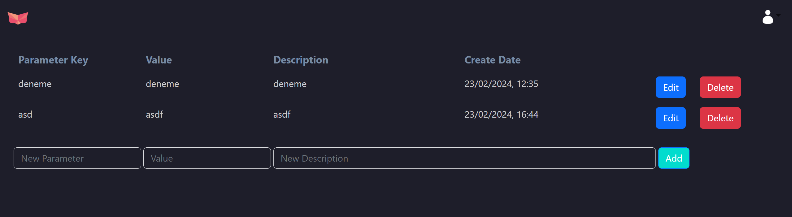

# The Frontend of the Config Management API 

## Description

This project is designed to interact with [Config Management API](https://github.com/mrerol/config-management-api) that facilitates the management of configurations for web applications. Vue.js 3, a progressive JavaScript framework, is employed to build a dynamic and responsive user interface.

## Dependencies
```json
"dependencies": {
    "@popperjs/core": "^2.11.8",
    "axios": "^1.6.2",
    "bootstrap": "^5.3.2",
    "firebase": "^10.7.1",
    "pinia": "^2.1.7",
    "vue": "^3.3.11",
    "vue-cookie-next": "^1.3.0",
    "vue-router": "^4.2.5"
  },
  "devDependencies": {
    "@vitejs/plugin-vue": "^4.5.2",
    "sass": "^1.69.5",
    "vite": "^5.1.4"
  },
```

## Environment Variables
```bash
VITE_FIREBASE_CONFIG=
VITE_API_URL=
```

Place these variables in the ```.env``` file in the same directory as ```App.vue```.

- ```VITE_FIREBASE_CONFIG``` represents the settings for the Firebase database.

- ```VITE_API_URL``` is the endpoint for backend api.

## Installation

You can use the following commands to install the project.

```bash
git clone <repository-url>
cd <repository-name>
npm install
npm run start
```

This the sign-in page: (Endpoint: /signin)


This is the config list page: (Endpoint: /)
